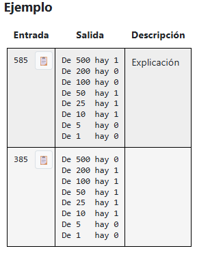

# Lenguaje de Programación II

# Autor
- Jose Carlos Chino Nina

## Laboratorio 01: Solución a un problema intermedio de OmegaUp.
- URL:
  
  https://omegaup.com/arena/problem/Contando-Monedas/
  
- Descripción del problema:
  
  El señor Mordechai tiene una pequeña tienda, y como a el le gusta ser organizado te ha pedido ayuda ya que sabe que eres un buen programador, por lo tanto te ha pedido realizar un programa que separe una cantidad cualquiera, este programa debe de ser capaz de contar cuantas monedas de 500, 200, 100, 50, 25, 10, 5, 1 hay.

- Input.

  Debes leer una cantidad cualquiera y dividirla en monedas.

- Output.

  Debes de mostrar la cantidad correspondiente.
  
- Ejermplos.  
  
## Tecnología Utilizada
- Visual Studio Code.
- Compilador GCC/G++.
- Git.
- GitHub.

## ¿Qué cosas resaltantes aprendí en este laboratorio?
- He aprendido a crear y gestionar un repositorio Git de forma local. También he logrado resolver problemas en la plataforma OmegaUp.

